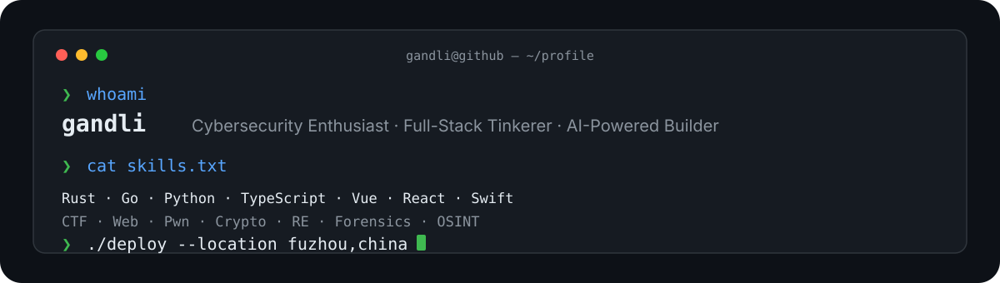

  

  
  
  

---

### 🧑💻 About Me

- 🔒 **Network Security** — CTF player, 2× provincial cybersecurity competition winner, national team award
- 🤖 **AI-Driven Developer** — I build things with AI, not just about AI
- 🛠️ Building browser extensions, WeChat mini-programs, iOS apps & web tools
- 🌏 Based in Fuzhou, China

### 🔧 Tech Stack

---

<!--
START_SECTION:PROJECTS
Maintained by the Update README Projects workflow (scripts/update-readme.py).
It appends missing repos to the Ideas table only; all other tables are hand-curated.
END_SECTION:PROJECTS
-->

## 🚀 Featured Projects

> A curated selection from 80+ public repos. Full list: [gandli?tab=repositories](https://github.com/gandli?tab=repositories)

### 🔐 Security & CTF (core focus)

| Project | Description |
|---------|-------------|
| [fscanx](https://github.com/gandli/fscanx) | Win7-compatible fork of fscan — intranet asset survey (protocol/web fingerprint, brute-force, PoC), SOCKS5 proxy traversal. Go 1.20 + UPX, auto cross-platform release |
| [vagent](https://github.com/gandli/vagent) | Rust TUI for managing proxy deployments across multiple VPS servers |
| [ctf-tui-launcher](https://github.com/gandli/ctf-tui-launcher) | Rust TUI for CTF practice with one-key Docker startup & dynamic flag injection |
| [reverse-shell-generator](https://github.com/gandli/reverse-shell-generator) | Raycast extension for generating reverse shells (40+ types) for security testing |
| [NacosExploit](https://github.com/gandli/NacosExploit) | Nacos vulnerability exploitation toolkit |
| [security-digest](https://github.com/gandli/security-digest) | Raycast extension for daily cybersecurity news with AI summaries & CVE merging |
| [space-query-skill](https://github.com/gandli/space-query-skill) | Build search queries for FOFA, Quake, ZoomEye, Shodan and more |
| [ctf-skills](https://github.com/gandli/ctf-skills) | Agent skills for solving CTF challenges (web/pwn/crypto/RE/forensics/OSINT) |
| [burpsuite-extension-skill](https://github.com/gandli/burpsuite-extension-skill) | Burp Suite extension development skill for OpenCode |
| [cybersecurity-aggregator](https://github.com/gandli/cybersecurity-aggregator) | Real-time threat intelligence hub |
| [bird-shield-blocking](https://github.com/gandli/bird-shield-blocking) | Shared blocklist for Twitter Bird Shield extension |
| [dbrecon](https://github.com/gandli/dbrecon) | Database security reconnaissance tool (authorized testing / education) |
| [yctf](https://github.com/gandli/yctf) | Modern open-source CTF competition platform (烟起旗扬) |
| [hongminggu-ctf-2026-writeups](https://github.com/gandli/hongminggu-ctf-2026-writeups) | 2026 Digital China Innovation Contest & Sanming Hongminggu Cup CTF writeups |

### 🦞 OpenClaw Ecosystem

| Project | Description |
|---------|-------------|
| [openclaw](https://github.com/gandli/openclaw) | Your own personal AI assistant. Any OS. Any Platform. 🦞 |
| [lobster](https://github.com/gandli/lobster) | OpenClaw-native workflow shell for composable pipelines |
| [acpx](https://github.com/gandli/acpx) | Headless CLI for stateful ACP sessions |
| [clawhub](https://github.com/gandli/clawhub) | Skill Directory for OpenClaw |
| [openclaw.ai](https://github.com/gandli/openclaw.ai) | Official website of openclaw.ai |
| [openclaw-gateway-repairer](https://github.com/gandli/openclaw-gateway-repairer) | Auto-repair script for OpenClaw Gateway |
| [obsd](https://github.com/gandli/obsd) | Personal knowledge base with PARA structure |
| [openclaw-security-validation](https://github.com/gandli/openclaw-security-validation) | Security validation tools and test suites for OpenClaw deployments |
| [url-insight](https://github.com/gandli/url-insight) | OpenClaw skill that auto-analyzes URLs — structured summaries + personalized actions |

### 🛠️ Developer Tools & Infra

| Project | Description |
|---------|-------------|
| [mupdf-mini-rs](https://github.com/gandli/mupdf-mini-rs) | Minimalist MuPDF viewer in Rust, powered by mupdf-rs |
| [pdf_oxide](https://github.com/gandli/pdf_oxide) | Fork of the fastest PDF library for Python & Rust (text/image/markdown extraction) |
| [stars-archive](https://github.com/gandli/stars-archive) | GitHub Stars Archive — auto-synced daily with AI search |
| [weread-skills](https://github.com/gandli/weread-skills) | Official WeRead Agent Skills collection (auto-synced) |
| [amap-skills](https://github.com/gandli/amap-skills) | Gaode Maps JSAPI v2.0 AI coding skill pack (npx skills install) |
| [docx-ai-editor](https://github.com/gandli/docx-ai-editor) | DOCX AI Editor with SuperDoc and LLM integration |
| [iflow-cli](https://github.com/gandli/iflow-cli) | Terminal-based CLI intelligence with AI coding |
| [chat-export-toolkit](https://github.com/gandli/chat-export-toolkit) | Multi-platform chat export and backup toolkit |
| [markdown-viewer-extension](https://github.com/gandli/markdown-viewer-extension) | Markdown to Word converter with Mermaid/LaTeX support |
| [brew-backup](https://github.com/gandli/brew-backup) | Homebrew backup and sync utility |
| [memorable-password-generator](https://github.com/gandli/memorable-password-generator) | Generate memorable, secure passwords |
| [daily-digest](https://github.com/gandli/daily-digest) | GitHub Trending → Telegram daily Chinese digest bot on Cloudflare Workers free tier |
| [daily-digest-archive](https://github.com/gandli/daily-digest-archive) | Auto-generated daily archive for daily-digest bot |
| [picwall](https://github.com/gandli/picwall) | Local-first polaroid photo wall — drag-and-drop uploads, masonry layout, in-browser AI captioning |
| [bookmarks](https://github.com/gandli/bookmarks) | Browser bookmarks backup (Chrome/Edge JSON) |
| [proxy-app-list](https://github.com/gandli/proxy-app-list) | 全平台代理客户端精选列表（归档） |
| [readme.skill](https://github.com/gandli/readme.skill) | standard-readme specification encoded as an agent skill |
| [data-annotation-course](https://github.com/gandli/data-annotation-course) | 数据标注课程自动化解题脚本 |
| [homebrew-opencli-rs](https://github.com/gandli/homebrew-opencli-rs) | Homebrew tap for opencli-rs |
| [scoop-motrix-next](https://github.com/gandli/scoop-motrix-next) | Scoop bucket for Motrix Next |

### 🌐 Web, Typing & Visual

| Project | Description |
|---------|-------------|
| [vmware-downloads](https://github.com/gandli/vmware-downloads) | ⭐ Auto-collect VMware Workstation/Fusion download links (44★) |
| [fz-metro-typing](https://github.com/gandli/fz-metro-typing) | Fuzhou Metro real-station typing practice (6 lines · 117 stations, 3 languages) |
| [tw-metro-typing-zh-cn](https://github.com/gandli/tw-metro-typing-zh-cn) | Taiwan MRT station typing practice, Simplified-Chinese localized |
| [cardia-survey](https://github.com/gandli/cardia-survey) | Beating-heart medical visualization (localized + mobile-adapted) |
| [phoenix-crown](https://github.com/gandli/phoenix-crown) | Chinese character "phoenix crown" curtain — pretext real glyph width + verlet physics |
| [cig3d](https://github.com/gandli/cig3d) | 中国香烟 3D 交互式真伪鉴别工具（React Three Fiber） |
| [world-cup-letter-flags-zh-cn](https://github.com/gandli/world-cup-letter-flags-zh-cn) | 四强字母旗 · 2026 世界杯四强 26 人大名单字母帘幕互动装置 (简体中文本地化) |
| [llmfit-web](https://github.com/gandli/llmfit-web) | LLM model fitness tracking and visualization web platform |
| [gandli.github.io](https://github.com/gandli/gandli.github.io) | 🦞 Lobster Diary — Daily work journal, Hugo-powered with auto cover art + TTS audio |

### 🤖 AI Browser Extensions

| Project | Description |
|---------|-------------|
| [ai-proofduck-extension](https://github.com/gandli/ai-proofduck-extension) | AI writing assistant with Chrome built-in AI (Gemini Nano), local WebGPU/WASM & online API |
| [readto-chrome-extension](https://github.com/gandli/readto-chrome-extension) | Chrome extension adding Chinese annotations above English words by CEFR level |
| [docx-reviewer](https://github.com/gandli/docx-reviewer) | Local LLM-powered DOCX review tool (semantic search, revision tracking) |
| [chrome-bookmark-extension](https://github.com/gandli/chrome-bookmark-extension) | Bookmark management with dead link detection & AI tag generation |
| [chinese-proofread](https://github.com/gandli/chinese-proofread) | 本地离线中文智能校对扩展 — MacBERT4CSC ONNX (114MB Q8), WebGPU, 零数据上传 |
| [writing-polisher-extension](https://github.com/gandli/writing-polisher-extension) | Pure browser-side Chinese spelling correction — 100% offline ONNX Runtime Web |

### 🚬 Tobacco & Cigar / 🏥 Health

| Project | Description |
|---------|-------------|
| [tobacco-atlas](https://github.com/gandli/tobacco-atlas) | Comprehensive guide to Chinese tobacco products |
| [tobacco-situation-monitor](https://github.com/gandli/tobacco-situation-monitor) | OSINT-based tobacco monopoly regulation monitoring |
| [ciggies-crawler](https://github.com/gandli/ciggies-crawler) | Web crawler for ciggies.app product data |
| [ai-nutritionist-app](https://github.com/gandli/ai-nutritionist-app) | AI-driven nutrition management with drug-nutrition interaction detection |
| [quit-smoking-dtx](https://github.com/gandli/quit-smoking-dtx) | Behavior science-based smoking cessation iOS app (DTx) |
| [cttc-auto-learn](https://github.com/gandli/cttc-auto-learn) | Automated video learning for China Tobacco's online training platform (mooc.ctt.cn) |
| [vehicle-management-chatui](https://github.com/gandli/vehicle-management-chatui) | Vehicle fleet management system with ChatUI interface |

### 📱 Mobile & Web Apps

| Project | Description |
|---------|-------------|
| [CigarAtlas](https://github.com/gandli/CigarAtlas) | Community app for cigar enthusiasts: tasting journal, social circles, meetups |
| [baby-vault](https://github.com/gandli/baby-vault) | Privacy-first baby growth tracking — data stays home |
| [weather-in-calendar](https://github.com/gandli/weather-in-calendar) | Integrate weather forecasts into calendar events with ICS generation |
| [bill-hub](https://github.com/gandli/bill-hub) | Multi-platform bill management with AI-powered spending analysis |
| [chinese-characters-learner](https://github.com/gandli/chinese-characters-learner) | Learn 7,000 common Chinese characters with quiz modes |
| [star-sage-app](https://github.com/gandli/star-sage-app) | GitHub starred repo management with AI-enhanced knowledge base |
| [med-mate-app](https://github.com/gandli/med-mate-app) | Localized health management for chronic disease — medication, symptom tracking, follow-up reminders |
| [VoiceInputTool](https://github.com/gandli/VoiceInputTool) | Transform your smartphone into a USB-connected voice input device |
| [canteen-ordering-app](https://github.com/gandli/canteen-ordering-app) | Canteen ordering management system — menu browsing, ordering, payment, meal pickup |

### 💡 Ideas & Concepts

| Project | Description |
|---------|-------------|
| [ai-goal-manager](https://github.com/gandli/ai-goal-manager) | AI-driven personal goal management: planning, journaling, reflection |
| [catholic-app](https://github.com/gandli/catholic-app) | Catholic believer app: Scripture, liturgy guides, spiritual growth |
| [LeadSight](https://github.com/gandli/LeadSight) | Multi-modal clue management iOS app for law enforcement |
| [unit-dispatch](https://github.com/gandli/unit-dispatch) | Unit dispatch management system |
| [OpenMAIC](https://github.com/gandli/OpenMAIC) | Open Multi-Agent Interactive Classroom |
| [anatomy-3d-explorer](https://github.com/gandli/anatomy-3d-explorer) | Interactive 3D human anatomy explorer built with Three.js — procedural geometry, layered dissection |
| [cigarette-code-registration](https://github.com/gandli/cigarette-code-registration) | Mini-program for cigarette spray-code registration — 16 digits + 4 letters + 12 digits |
| [crime-scene-3dgs](https://github.com/gandli/crime-scene-3dgs) | 3D Gaussian Splatting for tobacco enforcement crime-scene digitization |
| [fake-tobacco-network-graph](https://github.com/gandli/fake-tobacco-network-graph) | Graph analysis of counterfeit tobacco sales networks — attack-chain modeling for illicit trade investigation |
| [min-dialect-research](https://github.com/gandli/min-dialect-research) | Min dialect (Fuzhou/闽语) research toolkit — phonology, lexicon, IPA transcription, corpus analysis |
| [tobacco-rag-assistant](https://github.com/gandli/tobacco-rag-assistant) | RAG-powered assistant for tobacco monopoly inspection — regulations, case precedents, industry knowledge |
| [social-monitoring-system](https://github.com/gandli/social-monitoring-system) | Intelligent monitoring of illegal activities on social platforms — NLP analysis, image recognition, network mapping |
| [timescape-app](https://github.com/gandli/timescape-app) | Photography app combining time-travel imaging, future prediction, AR, and folk culture exploration |

### 📦 Package Management Contributions

Contributing to community package managers:

- [ScoopInstaller/Main](https://github.com/gandli/Main) — Scoop default bucket
- [microsoft/winget-pkgs](https://github.com/gandli/winget-pkgs) — Windows Package Manager
- [homebrew-ctf-tui](https://github.com/gandli/homebrew-ctf-tui) — Homebrew tap for CTF TUI
- [homebrew-iflow](https://github.com/gandli/homebrew-iflow) — Homebrew tap for iFlow CLI
- [scoop-bucket](https://github.com/gandli/scoop-bucket) — Personal Scoop bucket

---

## 📊 Stats

  

  
  

---

  <em>Building in public — one commit at a time.</em>

