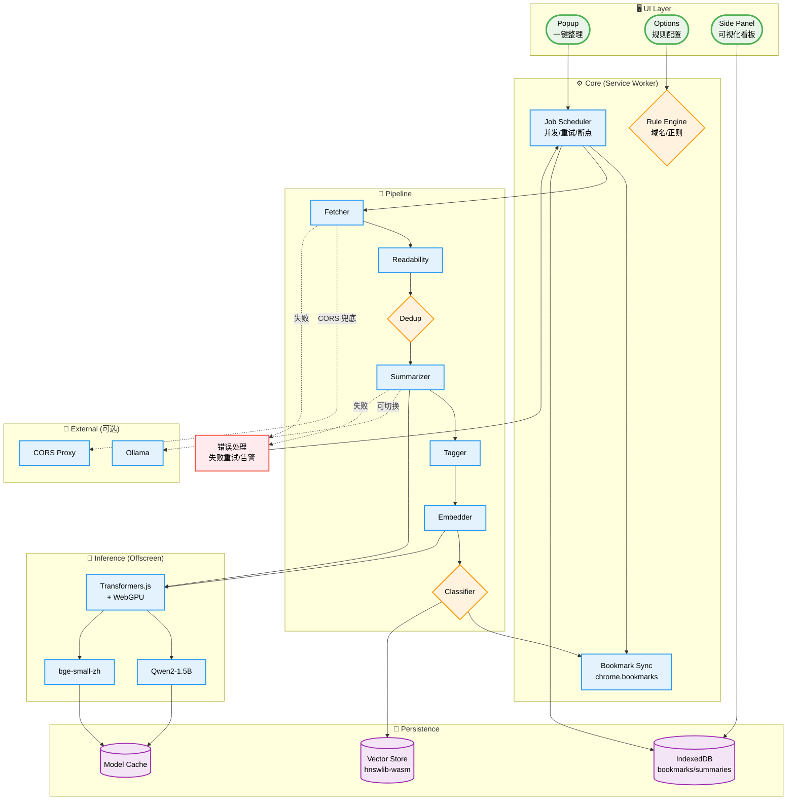
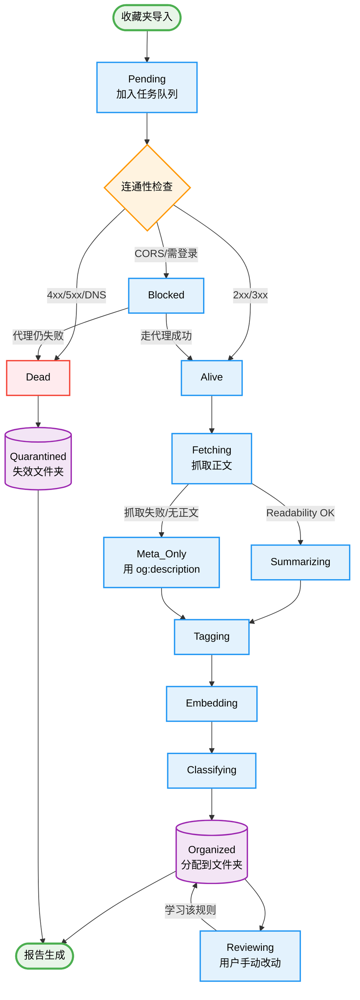

# ai-bookmark-organizer

> One-click sort my ~2000 Chrome bookmarks into meaningful folders — offline, using a local LLM for summaries + embeddings for clustering — while flagging dead links.

**Status:** 📐 Diagrams done · **Stack:** Chrome MV3 + Offscreen + Qwen2 + bge-small-zh + hnswlib-wasm

## The itch

My bookmarks bar is graveyard-shaped: half dead links, half "I might read this someday". I've tried every online "AI bookmark organizer" — they all want to upload my URLs to their servers. Not happening.

## Constraints

- 🔒 Fully local — no URL leaves the browser
- 🇨🇳 Chinese-first LLM + Chinese embedding model
- ⚙️ Non-destructive — every move is reversible in one click
- 📊 Explainable — user sees *why* the LLM proposed each folder

## Architecture

## Ingest → classify pipeline

```mermaid
flowchart LR
    A[chrome.bookmarks<br/>getTree] --> B{URL 归一化<br/>去 utm/fragment}
    B --> C[Dedup<br/>URL hash + 标题 simhash]
    C --> D{连通性检查}
    D -->|200 OK| E[Fetch HTML]
    D -->|3xx| E2[跟随重定向<br/>更新 URL]
    D -->|404/DNS| DEAD[(标记 dead<br/>待删清单)]
    D -->|超时/CORS| PROXY[走代理重试]
    PROXY --> E
    E2 --> E
    E --> F[Readability<br/>提取正文]
    F --> G[OG/meta<br/>title/description]
    G --> H[本地摘要<br/>Qwen2 生成 80 字]
    H --> I[标签抽取<br/>关键词 + 命名实体]
    I --> J[Embedding<br/>bge-small-zh-v1.5]
    J --> K{分类策略}
    K -->|规则命中| L1[规则分类<br/>域名/正则]
    K -->|Embedding 聚类| L2[HDBSCAN/KMeans]
    K -->|已存在文件夹| L3[最近邻分配]
    L1 --> M[(写回 chrome.bookmarks<br/>移动到目标文件夹)]
    L2 --> M
    L3 --> M
    DEAD --> N([整理报告])
    M --> N

classDef startEndStyle fill:#e8f5e8,stroke:#4caf50,stroke-width:3px,color:#000
classDef processStyle fill:#e3f2fd,stroke:#2196f3,stroke-width:2px,color:#000
classDef decisionStyle fill:#fff3e0,stroke:#ff9800,stroke-width:2px,color:#000
classDef dataStyle fill:#f3e5f5,stroke:#9c27b0,stroke-width:2px,color:#000
classDef errorStyle fill:#ffebee,stroke:#f44336,stroke-width:2px,color:#000

class A,N startEndStyle
class B,D,K decisionStyle
class C,E,E2,F,G,H,I,J,L1,L2,L3,PROXY processStyle
class DEAD errorStyle
class M dataStyle
```

## Bookmark lifecycle

## Undo model

Every batch operation writes to a `history` table in IndexedDB with `{before, after, timestamp}`. Panic button rolls back the last N batches by replaying `chrome.bookmarks.move` in reverse.

## Open questions

- [ ] Cold-start folder taxonomy — regex seed, LLM propose, user confirm?
- [ ] CORS-blocked sites: fallback to OG meta only, or route through a user-chosen local proxy?
- [ ] Should embeddings persist across re-runs (delta sync) or rebuild from scratch each time?
- [ ] Cross-device sync — leave to Chrome's own bookmark sync, or store our metadata in a Cloud Sync-blessed extension storage?

## Milestones

1. Fetch + Readability + dead-link report only (no LLM)
2. Add Qwen2 summarization + tag extraction
3. Add bge embeddings + HDBSCAN clustering
4. Rule engine + user-confirm UI
5. History + undo
6. Cross-run delta sync
