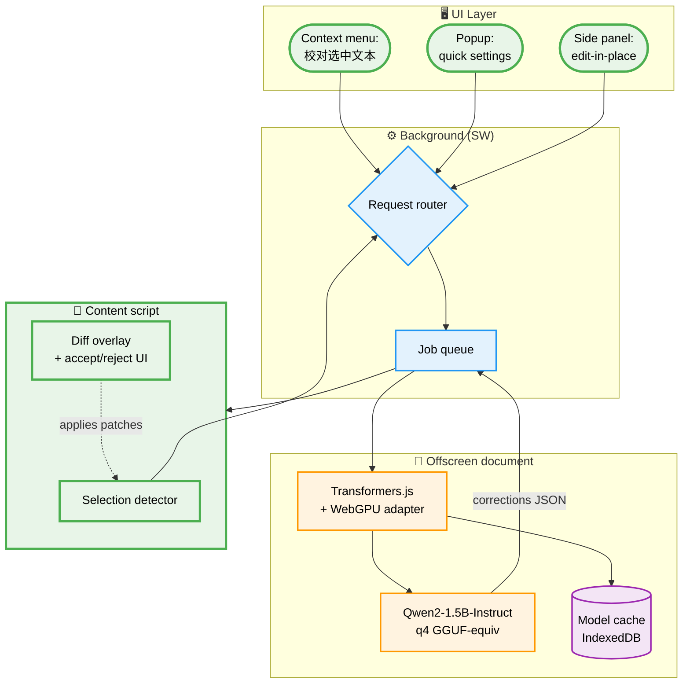

# local-proofread-extension

> A Chrome MV3 extension that proofreads whatever you're reading or writing on any web page — using a local Qwen2 model running on WebGPU. Nothing leaves your browser.

**Status:** 📐 Diagrams done · **Stack:** Chrome MV3 + Offscreen Document + Transformers.js + WebGPU + Qwen2-1.5B-Instruct

## The itch

Chinese proofreading tools are either (a) cloud-hosted (privacy 💀), (b) browser-only rule-based (weak), or (c) desktop apps (not integrated with the browser). I want **grammar / typo / logic** feedback on any highlighted text in Chrome, running fully offline.

## Constraints

- 🔒 **Fully local** — no network egress after model download
- 🇨🇳 **Chinese-first model** — Qwen2, not Llama-3
- 🖥️ **Mac mini 8GB** — model ≤ 1 GB after quantization
- ⚡ **First token < 2 s** on cold call — Offscreen keeps the model warm

## Architecture



## Proofread flow

```plantuml
@startuml
skinparam defaultFontName "PingFang SC"
skinparam activityBackgroundColor #e3f2fd
skinparam activityBorderColor #2196f3
skinparam activityDiamondBackgroundColor #fff3e0
skinparam activityDiamondBorderColor #ff9800

start
:User selects text +
right-click "校对";
:Content script sends
{text, url, lang}
to background;
if (Model warm?) then (yes)
  :Route to offscreen;
else (no)
  :Load Qwen2 from
  IndexedDB cache;
  if (Cached?) then (no)
    #f3e5f5:Download from HuggingFace;
  endif
  :Warm up WebGPU;
endif
:Chunk text (max 512 tok);
:Prompt: "找出错误并
以 JSON 返回 corrections[]";
:LLM generates;
:Parse JSON;
if (Valid?) then (yes)
  :Compute diff spans;
  #fce4ec:Render inline overlay;
  :User accept / reject;
else (no)
  #ffebee:Fall back to
  rule-based checker;
endif
stop
@enduml
```

## Prompt shape

```json
{
  "system": "你是一名中文校对助手。找出用户提供文本中的错别字、语法、标点、事实错误。以严格 JSON 数组返回，不要多余说明。",
  "user": "文本：{{TEXT}}\n返回格式：[{start, end, type, original, suggestion, reason}]"
}
```

## Model choice

| Model | Size (q4) | 中文 | 首 token 延迟 | 选它？ |
|---|---:|---|---:|---|
| Qwen2-1.5B-Instruct | ~1.0 GB | ✅ 强 | ~800 ms | ✅ 默认 |
| Qwen2-7B-Instruct | ~4.5 GB | ✅✅ | ~2.5 s | 可选（8GB Mac 勉强） |
| Llama-3-8B | ~4.8 GB | ⚠️ 弱 | ~2.5 s | ❌（用户拒绝英文模型跑中文） |
| Phi-3-mini | ~2.4 GB | ⚠️ 中 | ~1.5 s | ❌ |

## Open questions

- [ ] Should we auto-run on every focus-blur of `<textarea>` / `contenteditable`? Or only manual trigger?
- [ ] Custom rules per site (`微博.com` = 网络语气，`gov.cn` = 公文)?
- [ ] Where do accepted corrections go — clipboard, `document.execCommand('insertText')`, or DOM patch?
- [ ] Export a "wrong-word notebook" of things the user rejected (learn user style)?

## Milestones

1. Prototype: Offscreen doc that answers `chrome.runtime.sendMessage` with model output
2. Content script + selection UI
3. Diff overlay with accept/reject
4. Site-specific rule packs
5. Wrong-word notebook + review flow
