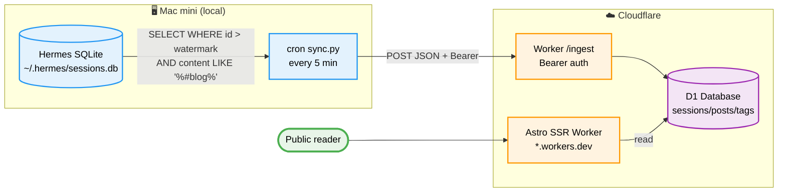
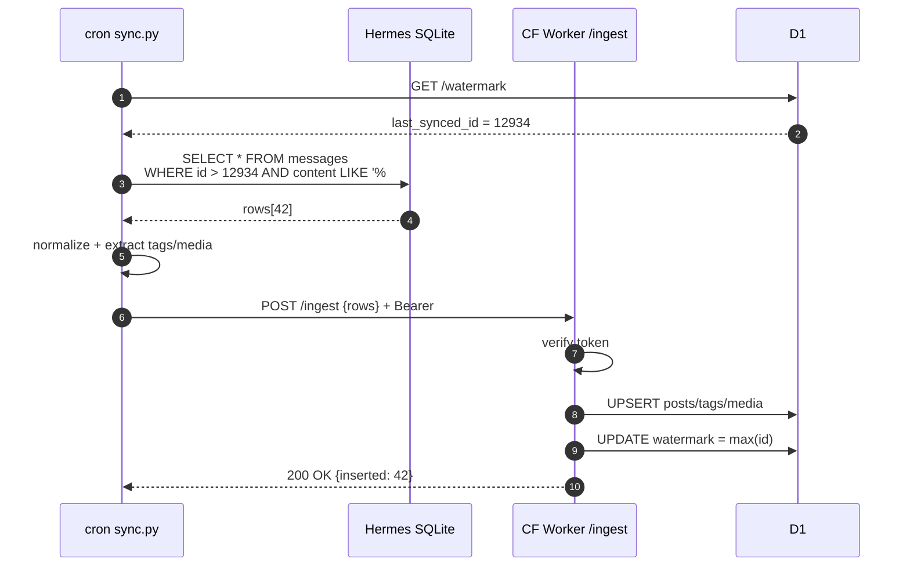
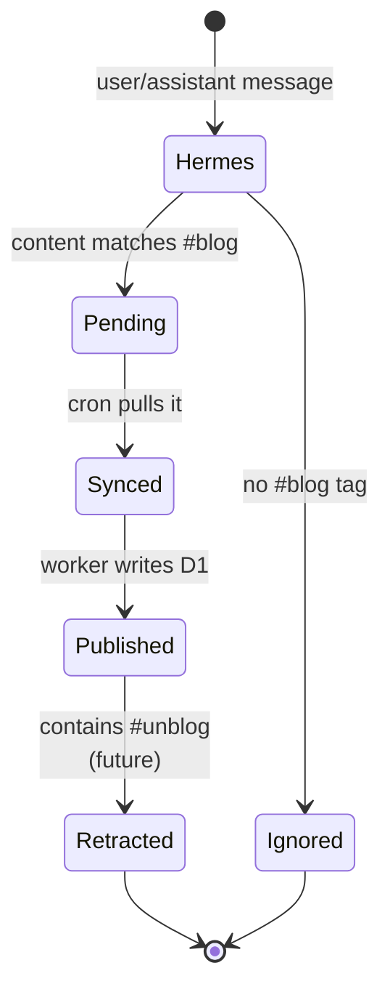

# tg-hermes-blog

> Auto-publish tagged conversations between me and my Telegram Hermes-Agent bot as a public micro-blog, hosted on Cloudflare.

**Status:** 🆕 Designed · **Stack:** Cloudflare Workers + D1 + Astro SSR + Python cron · **Inspired by:** [miantiao-me/BroadcastChannel](https://github.com/miantiao-me/BroadcastChannel)

## The itch

I already talk to my Telegram Hermes bot every day — that's where my thinking gets rehearsed. I want the messages tagged `#blog` to become a public feed, without me copy-pasting anything, and without giving anyone else my Hermes SQLite.

## Non-goals

- ❌ Not a full CMS — no editor, no admin UI
- ❌ Not real-time — 5-min lag is fine
- ❌ Not a Telegram bot rewrite — Hermes stays untouched

## Architecture



## Data model (D1)

```sql
CREATE TABLE sessions (
  session_id TEXT PRIMARY KEY,
  title      TEXT,
  created_at INTEGER,
  updated_at INTEGER
);

CREATE TABLE posts (
  id         INTEGER PRIMARY KEY AUTOINCREMENT,
  session_id TEXT REFERENCES sessions(session_id),
  message_id INTEGER,           -- Hermes message.id
  role       TEXT,              -- 'user' | 'assistant'
  content    TEXT,
  ts         INTEGER,
  published  BOOLEAN DEFAULT 0,
  raw_json   TEXT,
  UNIQUE(session_id, message_id)
);

CREATE TABLE tags (
  id      INTEGER PRIMARY KEY AUTOINCREMENT,
  post_id INTEGER REFERENCES posts(id),
  tag     TEXT
);

CREATE TABLE media (
  id      INTEGER PRIMARY KEY AUTOINCREMENT,
  post_id INTEGER REFERENCES posts(id),
  type    TEXT,   -- 'image' | 'file' | 'link'
  url     TEXT,
  alt     TEXT
);

CREATE TABLE watermarks (
  key   TEXT PRIMARY KEY,       -- 'last_synced_id'
  value INTEGER
);
```

## Sync sequence



## Message state machine



## Trigger rules

- **Publish**: any message containing `#blog` (case-insensitive)
- **Idempotent**: `(session_id, message_id)` unique — safe re-runs
- **Retract** (later): `#unblog` sets `published = 0`
- **Series**: `#blog:series-name` groups into a series page

## Open questions

- [ ] Feed-level RSS? (probably yes — reuse Astro's RSS integration)
- [ ] Full-text search? (D1 has FTS5 via virtual table — cheap)
- [ ] Comments? (out of scope — link to Telegram if reader wants to reply)
- [ ] Domain? (start on `*.workers.dev`, custom domain later)

## Why not…

| Alternative | Why not |
|---|---|
| Telegram Bot API webhook | Bot can't read its own replies verbatim |
| Fork BroadcastChannel as-is | Data source is `t.me/s/xxx` public channels — I don't want a public Telegram channel |
| Notion + public page | Requires me to move messages out of Telegram |
| Cross-post via Telegram → Zapier → CMS | Fragile, chain of proprietary hops |

## Milestones

1. ✅ Design docs (this file + diagrams)
2. Probe Hermes SQLite schema, write `sync/sync.py`
3. Cloudflare account + D1 database + `wrangler.toml`
4. Worker `/ingest` with Bearer auth
5. Fork BroadcastChannel, swap `src/lib/data.ts` to read from D1
6. Deploy to `*.workers.dev`, post first `#blog` message
